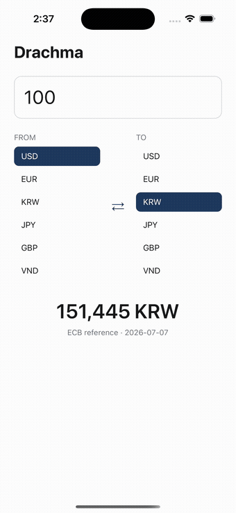
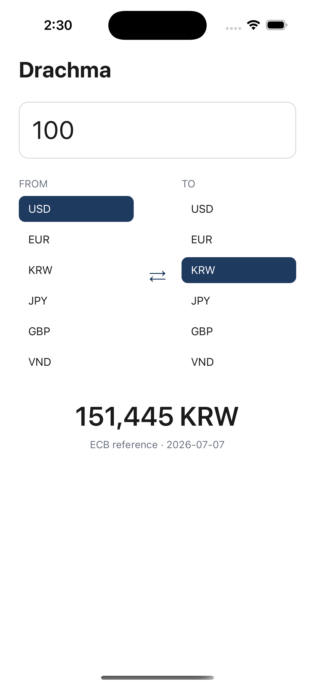
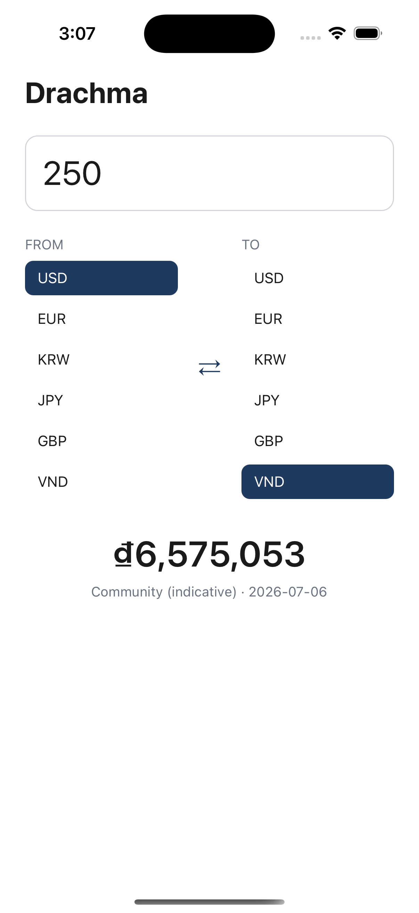
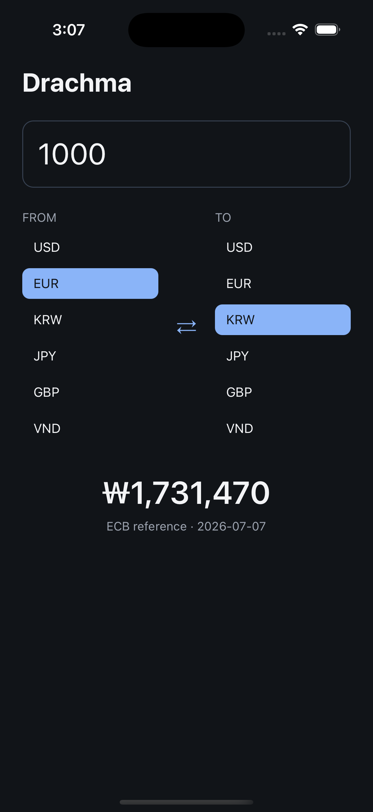
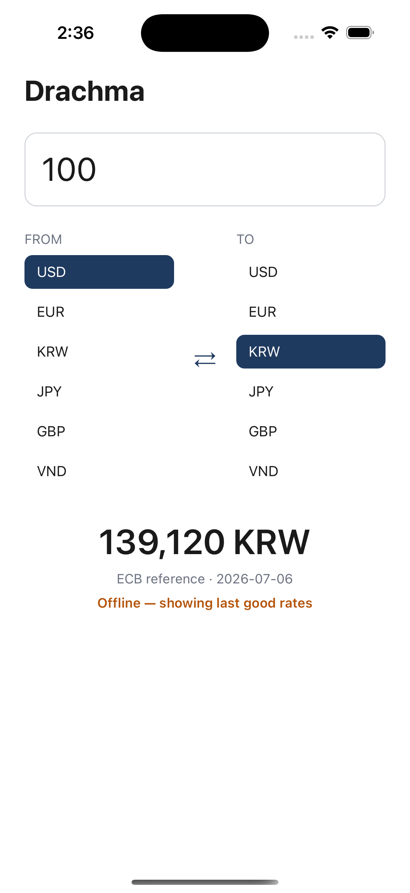
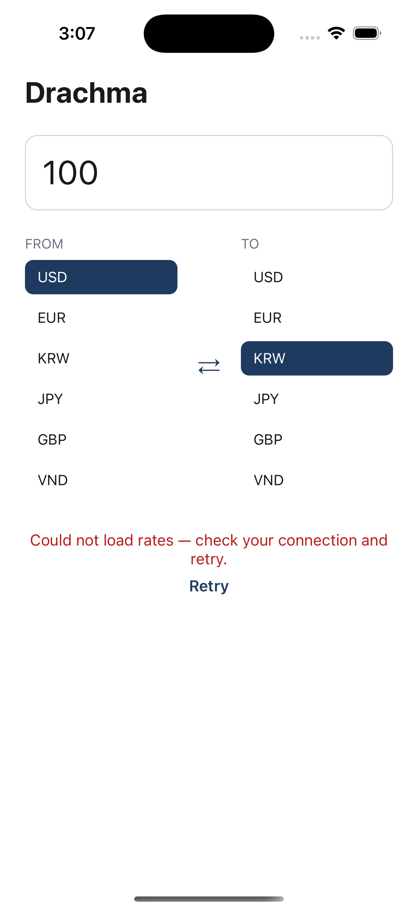
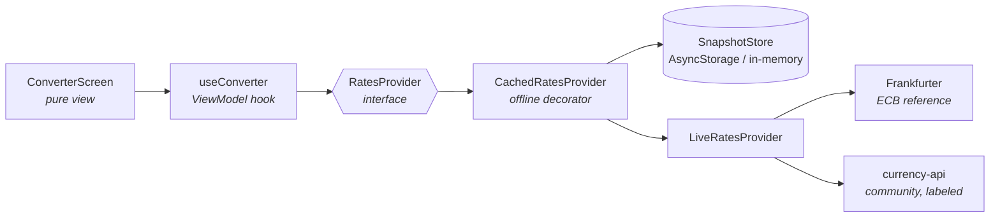

# Drachma RN

**Live currency conversion with honest data provenance — the [Drachma](https://github.com/sebkoo/drachma) platform's React Native client, for iOS and Android from one TypeScript codebase.**

[](https://github.com/sebkoo/drachma-rn/actions/workflows/ci.yml)
-61dafb)


<p align="center">
  
</p>
<p align="center"><em>Real session: long-tail currency (VND) with its honesty label → pair swap → dark mode.</em></p>

## Why this app exists

Drachma is one platform with several surfaces: a native SwiftUI iOS app, WidgetKit widgets, an MCP server for AI agents, and an OAuth 2.1-protected REST API. This repo is the next surface — the same product rebuilt in React Native, targeting **iOS and Android** from one codebase (the Android debug build is assembled by CI on every push).

It also answers a question with code instead of opinions: *having built the same product natively first, what does React Native make easier, and what harder?* The commit history is the lab notebook — every architecture decision below was translated from the native app and tested.

## Every user scenario, on screen

| Convert | Long-tail currency | Dark mode |
|:---:|:---:|:---:|
|  |  |  |
| Live keyless rates; every result carries its source: `ECB reference · 2026-07-07`. | VND isn't in the ECB set, so the app routes to the community source **and says so**: `Community (indicative)`. | Full dark palette, driven by the system setting. |

| Offline | Failure |
|:---:|:---:|
|  |  |
| Network down → the last good snapshot, dated, with an explicit **“Offline — showing last good rates.”** No silent staleness. | Network down with an empty cache → an honest error and a Retry. Never fake data. |

## Architecture — translated from the native app, not invented here

The SwiftUI Drachma app runs on three seams. Each has an exact React Native equivalent, and this repo implements all three:

| Native iOS (SwiftUI) | This repo (React Native) | What it buys |
|---|---|---|
| `PairRatesProviding` protocol — ViewModels never know Frankfurter exists | `RatesProvider` interface + React Context injection ([`provider.ts`](src/api/provider.ts), [`RatesContext.tsx`](src/di/RatesContext.tsx)) | Swapping/wrapping providers costs one line at the composition root; tests inject fakes through the same seam the app uses |
| MVVM — `@Observable` ViewModels | **Custom hook = ViewModel**: [`useConverter`](src/screens/useConverter.ts) owns all state and behavior; the screen is a pure view | The converter logic is tested against a fake provider with zero module mocks |
| Actor-based offline cache, timestamps always visible | [`CachedRatesProvider`](src/api/cachedProvider.ts) decorator + [`SnapshotStore`](src/storage/snapshotStore.ts) seam (AsyncStorage on device, in-memory in tests) | Every success cached; failures serve the last good snapshot **marked stale** — the UI says it out loud |
| Native platform strengths | **Custom Swift native module**: [`CurrencyFormatter`](ios/DrachmaRN/CurrencyFormatter.swift) exposes Foundation's `NumberFormatter` ([JS wrapper with fallback](src/native/currencyFormatter.ts)) | Locale-correct symbols and per-currency decimal rules (₩, ₫, ¥ take zero decimals) that Hermes's partial Intl can't provide |



Rules inherited from the platform:

- **Keyless data** — ECB reference rates via Frankfurter; community rates for the long tail. No API keys, no accounts, no tracking.
- **Provenance on screen** — every rate says where it came from. Indicative data is never dressed up as official. (The full-app render test literally asserts the label is on screen.)

## Deep links — every state is one URL away

The RN translation of the native app's launch-flag pattern (iOS URL scheme + Android intent filter, forwarded through `RCTLinkingManager`):

```
drachma://convert?from=USD&to=VND&amount=250   # open on a pair and amount
drachma://convert?demo=offline                 # seeded cache + dead network → the stale UI
drachma://convert?demo=error                   # dead network, no cache → the error UI
```

The `?demo=` hooks swap the provider **at the composition root through the same seam tests use** — no special UI paths. They're how the screenshots above were captured, and how you can reach any state in one command:

```sh
xcrun simctl openurl booted "drachma://convert?from=USD&to=VND&amount=250"
```

## Quality

- **91 Jest tests**: conversion math, ECB-vs-community provider routing, HTTP/payload failure paths, the cache decorator's semantics (fresh / stale / rethrow), the ViewModel against fake providers, deep-link parsing, currency-formatting fallbacks, a full-app render asserting the provenance label, the offline write-queue engine (idempotency, restart survival, optimistic add/delete), and cold-start timing math.
- **CI on every push**: typecheck (`tsc`), lint (`eslint`), tests (`jest`) — plus a real **iOS simulator build** and **Android `assembleDebug`**, because native builds catch breakage the JS loop can't see.
- Hand-rolled deep-link parsing with a reason: Hermes ships an incomplete WHATWG `URL`, so `new URL()` passes in Jest (Node) and breaks on device. The test suite pins the hand-rolled parser instead.

### Startup performance

Upstart's native-vs-webview reasoning is a performance argument, so this app measures before it optimizes. [`startupTrace`](src/perf/startupTrace.ts) marks the JS-visible launch path — bundle eval → first render → first meaningful content (rates on screen, the TTI signal) — and logs both durations in dev builds. The launch also renders immediately instead of holding a blank frame until the initial URL resolves (the old `if (!ready) return null`); a deep link folds in a beat later rather than delaying first paint. A native pre-JS mark is the documented next step; no number is claimed here until it is measured on device.

## Run it

```sh
npm install
npm test                                  # jest
cd ios && bundle install && bundle exec pod install && cd ..
npm run ios                               # iOS simulator
npm run android                           # Android emulator/device
```

## Roadmap

- [x] Typed rates client with provider routing + tests
- [x] Converter screen (dark mode, provenance label)
- [x] CI: JS checks + Android debug build on every push
- [x] Architecture seams from the native app: provider interface / ViewModel hook / offline last-good cache
- [x] Deep linking (`drachma://convert`) + URL-driven demo states
- [x] CI: iOS simulator build job
- [x] Custom native module in Swift: locale-correct currency formatting via `NumberFormatter` (₩151,445, ₫6,575,053 — zero-decimal rules Hermes's partial Intl can't know), with a JS fallback for Android/Jest
- [x] Startup instrumentation (cold-start marks) + immediate first paint
- [ ] 7-day history chart
- [ ] Currency search over the full 300+ community set

## Built in the open

Like everything in the Drachma family, this repo is built in the open with Claude Code — atomic commits, every red→green CI cycle preserved, every line reviewed. The interesting failures (the Hermes `URL` gap, the `RCTLinkingManager` forwarding, the jest preset gaps in the RN template) are documented in the commit history where they happened.

If this repo is useful as a React-Native-with-real-architecture reference, a ⭐ helps others find it.
